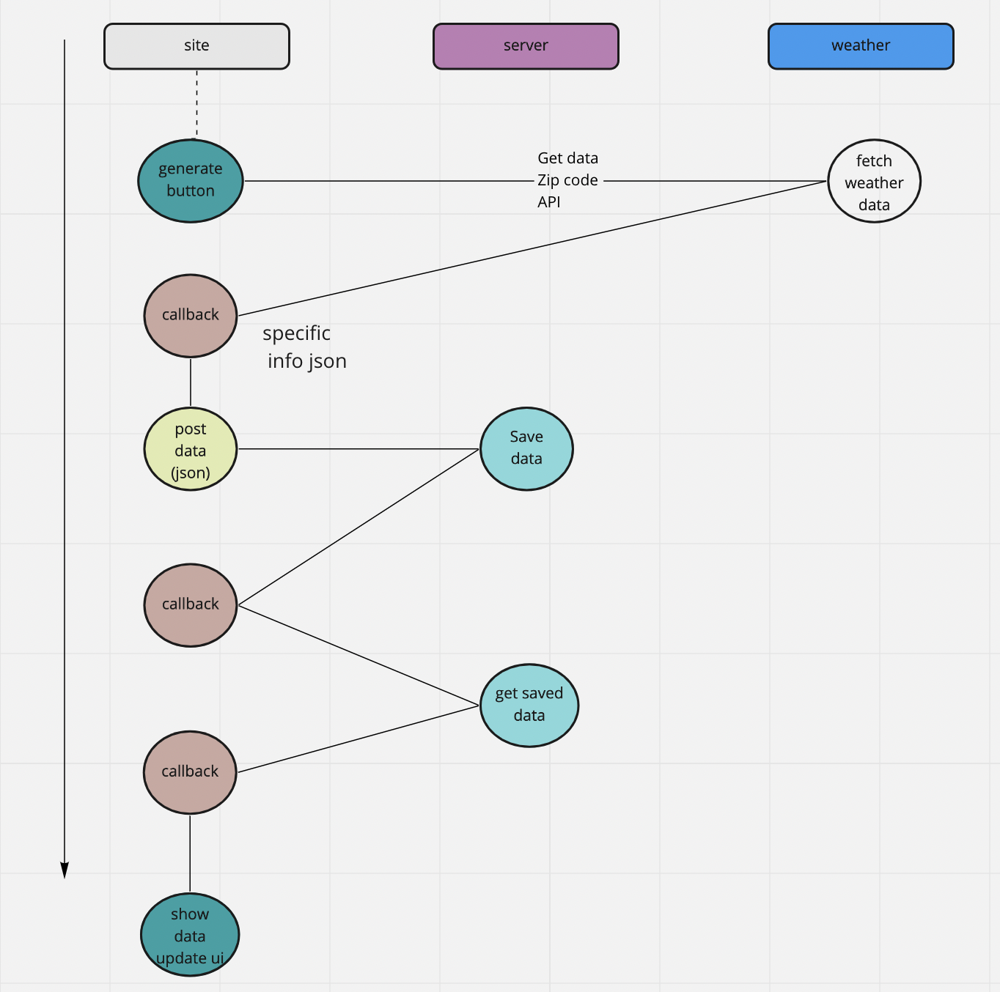
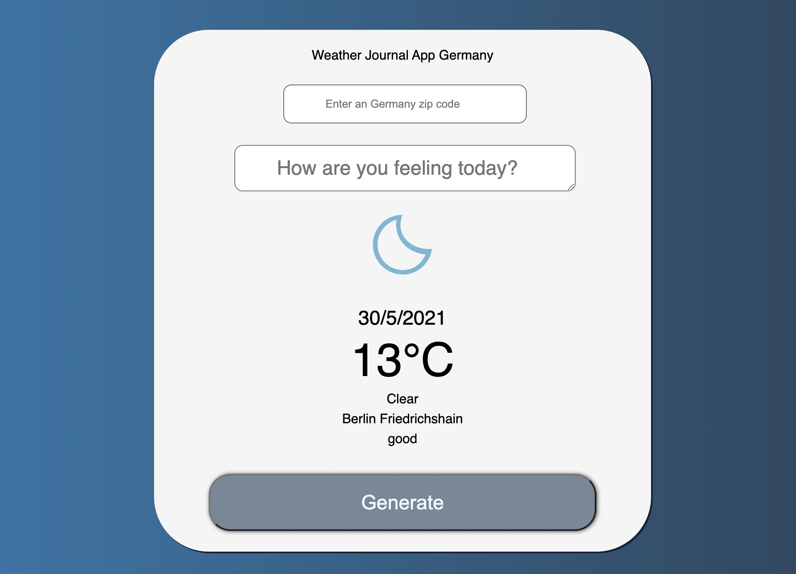

# WeatherJournalApp

Weather Journal App Germany helps you track your day and the weather forecast 
just put zip code.

## Installation

execute the server.js file with node server.js
Need has Node js install along with express and body-parser

- `npm install express`
- `npm install body-parser`
- `npm start`

## General info

This project is the project for Udacity's Front End Web Developer Nanodegree program.
 
 
This graph so that you, reader, can understand the step by step of the line of reasoning elaborated for this project which also consists of using the server and 1 Api from OpenWeather for this project.

### Preview 

